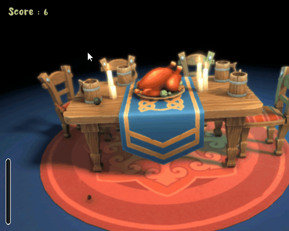

# Dinner TP

Le but de ce TP est de réaliser un petit jeu de lancer de légumes. Le joueur doit lancer les légumes dans les tasses pour marquer des points.

*Les scripts et les variables sont déjà créés. Utilisez les variables intelligement (normalement toutes sont à utiliser, pas besoin d'en rajouter). Attention les scripts ne sont pas forcément déjà placés dans la scène.*

## Lanceur

On travaille dans le script `VegetableThrower`.
1. Dans l'éditeur, créer un prefab d'un brocoli et un prefab d'une carrote pour créer des projectiles. On utilisera un ou plusieurs SphereColliders et un Rigidbody (pas besoin d'être précis). Paramètrer le drag à 1. Ajouter ces prefabs au tableau de légumes du `VegetableThrower`.
2. Créer une fonction `InstantiateRandomVegetable` qui instantie et retourne un légume aléatoire du tableau `vegetables`.
3. Créer une fonction `ThrowVegetable(Rigidbody vegetable, float throwForce)` qui applique la force de lancer au légume en mode *Impulse* ainsi qu'une force de rotation aléatoire au légume. Le légume doit être lancé vers l'avant du `VegetableThrower`. *Il y a déjà un comportement qui pivote l'avant du vegetal thrower dans la bonne direction.*
4. Faire en sorte que lorsque l'utilisateur maintient le clique gauche, la force de lancer se charge via la variable `throwForce01`. Lorsque l'utilisateur relache le bouton du clique gauche, le légume est lancé.
*Pour calculer la force de lancer, on peut utliser un Lerp entore min, max et `throwForce01`*

## Score

On travaille dans le script `GameManager`.
1. Ajouter une fonction publique pour ajouter des points au score.
2. Faire en sorte que les points soient sauvegardés lorsque l'on ferme le jeu et rechargés au lancement du jeu à l'aide de la documentation : https://docs.unity3d.com/ScriptReference/PlayerPrefs.SetInt.html
3. Créer un texte de type TextMeshPro dans le canvas d'UI et mettre à jour sa valeur en fonction du score actuel.

## But

On travaille dans le script `Goal`.
1. Dans l'éditeur, 
    1. Ajouter un objet contenant un collider de type *Trigger* placé à l'entrée d'une tasse.
    2. Créer en enfant de ce collider un effet de particules représentant une gerbe d'eau qui sort de la tasse. Décocher les notions de *looping* et *play on Awake* de ce système de particle.
    3. Ajouter le script `Goal` à l'objet contenant le collider.
    4. Ajouter cet objet pour chaque tasse.

2. Faire en sorte que le *Goal* joue l'effet de particule et ajoute des points au score lors d'une collision de type trigger (aka un légume rentre dans la tasse).

## Poulet

On travaille dans le script `BounceVegetable`.
1. Ajouter un sphere collider au poulet.
2. Ajouter une animation sur le poulet qui représente une collision avec un légume.
3. Faire en sorte que lors d'une collision, le poulet joue l'animation mais aussi ajoute une force de type *Impulse* à l'objet qui rentre en collision avec lui.
    1. Calculer le vecteur partant du centre du poulet vers l'objet qui entre en collision.
    2. Déterminer une nouvelle direction comme un Lerp entre ce vecteur pouler/objet et le vecteur vers le haut en fonction de `bounceUpward`. Le but est de créer un vecteur qui serait un mélange des deux.
    3. Normalizer ce vecteur.
    4. Utiliser ce vecteur comme direction pour la force à ajouter au légume.
